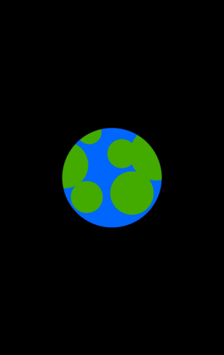

# :full_moon: Pogo Game Engine

Pogo is a 2D game engine for [Flutter](https://flutter.dev/) (Android, iOS, plus web and desktop in beta).

Pogo implements what I'm calling a "'Pseudo' Entity Component System" for lack of a better term.  Pogo's Pseudo ECS is very similar to the design pattern of other game engines that are extremely popular for rapid game development.  Pogo games are made entirely of game entities (a.k.a. game objects).  Game entities are built with modular components that are easy to understand.

Why a Pseudo ECS instead of a more pure ECS?  (1) I didn't see myself as having time to go that far into the ECS pattern; and (2) I believe this pattern is quicker to ramp up on while still being more than robust enough for any game written in Dart.



### Documentation

 * [**Getting Started Guide**](#getting-started-guide) :beginner: (further down on this page)
 * [**Pogo Reference Documentation**](doc/README.md) :books:
 * [The main example app](example/lib/main.dart) (seen above) shows how the core features fit together
 * [Various other example apps](doc/examples) demonstrate each component

### Showcase games

| Game | Android | iOS | macOS | Linux | Windows | Web |
| :--- | :-----: | :-: | :---: | :---: | :-----: | :-: |
| **_Pogo Bug_** | [released](https://play.google.com/store/apps/details?id=com.littlebigspeed.pogobug) | todo |
| example app | | | | | | [released](https://juanitogan.itch.io/pogo) |

### Background

Pogo was forked from [Flame 0.18.1](https://github.com/flame-engine/flame/tree/0.18.1) and redesigned with the goal of making it twice as easy to understand and use.  And... I believe I succeeded, with features like: game entities, better component design, intrinsic entity parenting, dynamic Z ordering, and sensible sprite and animation components.

All due credit to inu-no-policemen on Reddit and Luan Nico of Flame for setting up the core, which remains somewhat unchanged.  The rest of Flame, however, was showing growing pains, plus a reluctance to large changes in design.  Thus, I launched a new project which will, hopefully, be more agile to needed change before version 1.0.  Even at Pogo 0.0.1, just about everything above Flame's core was changed.  I also added many new features critical to how I build games.  See the [first CHANGELOG entry](CHANGELOG.md#001---2020-04-13) for an overview of just how enourmously different Pogo is from Flame.

Therefore, if you find a pre-release version of Pogo you like, lock it in, or be prepared for possible breaking changes.  (Although, if I did a decent job with round one here, there shouldn't be any more major shifts in design coming -- just shifts isolated to parts still in need of refactoring.  We'll see.)

The name, Pogo, comes from [_Pogo Bug_](https://play.google.com/store/apps/details?id=com.littlebigspeed.pogobug) -- the game I built this engine for.  (_Pogo Bug_ was originally written in QtQuick/QML but not released from that codebase due to Qt's difficult licensing issues.)  Thus, this engine is tried and tested on my own small-but-complete game from day one.  It took maybe 10x longer to work up this Flutter/Dart-based engine than to write the original Qt game.  Judging by how quickly I then ported _Pogo Bug_ to Pogo, versus how much trouble Flame was giving me, it seems Pogo was worth the effort.  Pogo feels nearly as quick to build a game in as QtQuick was... and with better performance.

### Contributing

Hit me with a PR and I'll try to find time to engage it.  No promises, but I'll try.  Hopefully others will jump in and help.  I pay close attention to naming and API consistency more so than code style -- code can be refactored without breaking things, naming and structure cannot.

There is still much to be done.  I quickly hacked through many components from the previous engine that I didn't need at the moment, just to get them working.  Thus, some components still need to be refactored to be more like the rest.

[NinePatchComponent](doc/components/nine_patch.md), [ParallaxComponent](doc/components/parallax.md), and [ParticleComponent](doc/components/particle.md) are some examples of things I just quick-hacked and saved for later.  (See the [Unreleased section in the changelog](CHANGELOG.md#unreleased) for a better TODO list.)  Most things still work as Flame had them working, but they may not be fully "Pogo-ized" yet.  I also haven't touched Box2D yet because _Pogo Bug_ doesn't need it.  (Another game of mine, _GRITS Racing_, uses Box2D heavily, so I should have the skills to work it in well when I get to it).

The core components I focused on the most are: [SpriteComponent](doc/components/sprite.md), [AnimationComponent](doc/components/animation.md), and the [gesture mixins](doc/input.md).  [TextComponent](doc/components/text.md) got a pretty solid work over as well.  These should be used as examples for how to refactor the rest.

:information_source: Note the changes coming with [Pogo 0.2.0](CHANGELOG.md#unreleased).

----

# Getting Started Guide

What you need to know up front.

## Adding the game engine to your project

Add the Pogo package dependency to your project's `pubspec.yaml`:

```yaml
dependencies:
  pogo: ^0.1.2
```

A single import is required in each source file to access the game engine objects, types, etc.:

```dart
import 'package:pogo/game_engine.dart';
```

## Asset files

All asset files are assumed to be found under the `assets` folder.  This is a limitation of at least one of the current plugins.

Furthermore, some subfolder defaults are set for certain asset types (the default can be changed with `setSubPath()` if desired).

The default asset tree looks like this:

```text
.
└── assets
    ├── audio
    │   └── explosion.mp3
    ├── images
    │   └── background.png
    └── svgs
        ├── enemy.svg
        └── player.svg
```

Also, you must list all asset files in your `pubspec.yaml` file:

```yaml
flutter:
  assets:
    - assets/audio/explosion.mp3
    - assets/images/background.png
    - assets/svgs/enemy.svg
    - assets/svgs/player.svg
```

## Game engine config and startup

This is the recommended sequence of code to start a game (expect changes here as things evolve):

```dart
import 'package:pogo/game_engine.dart';

void main() async {
  WidgetsFlutterBinding.ensureInitialized(); // required
  await Screen.setFullScreen(); // mobile - not for web app use
  await Screen.setPortrait(); // mobile - not for web app use

  Camera.size = Size(135, 240); // default is native resolution

  System.defaultPivot = Pivot.topLeft; // default default is center
  System.defaultPaint.isAntiAlias = false; // low-res games will want this

  GestureInitializer.detectTaps = true;
  GestureInitializer.detectPans = true;

  await Assets.audioCache.load("explosion.mp3");
  await Assets.rasterCache.load("background.png");
  await Assets.svgCache.loadAll(["enemy.svg", "player.svg"], scale: 0.75);

  runApp(Game().widget); // required

  await Screen.waitForStartupSizing(); // required

  MainEntity(); // you can name your startup entity whatever you like
}

class MainEntity extends GameEntity {
  MainEntity() {}
}
```

Note that you must initialize all gestures here that will be used anywhere in your game.  More on gestures [below](#entity-gestures).

It is recommended to cache your assets (the ones that currently _can_ be cached).  It is not required to cache them your `main()` but this is a good place to do it for simple games.  More complex games will want to use the cache features to load and clear assets.

[More game engine details here](doc/game.md).

## Game entities

A Pogo game is made entirely of game entities (from the GameEntity class).  An entity can be a sprite, a bullet, a container or parent to other entities (such as a scene, menu, or complex player), or whatever you need it to be.

Every game entity has:
 * a transform: `position`, `zOrder`, `rotation`, and `scale`
 * hierarchy connectors: `parent` and `_children[]`
 * the core `update()` method
 * an `enabled` property and a few other features

[More GameEntity details here](doc/game_entity.md).

Game entities are made up of components.  Some components are built into the entity (such as position/movable), some are added through mixins (such as the [TapDetector](doc/input.md#gesture-detector-mixins) mixin), and some are added by calling [component classes](doc/components.md) (such as [SpriteComponent](doc/components/sprite.md)).

Class-type components typically come with an `update()` or a `render()` method (or both) that must be called from the game entity's own `update()` in order for them to work.

> Note: I may choose to someday automatically register component `update()` and `render()` methods so you don't have to call them explicitly... but not today. 

The construction of a simple entity looks like this:

```dart
class Player extends GameEntity with {
  SpriteComponent playerSprite;
    
  Player(Vector2 position, int zOrder) {
    playerSprite = SpriteComponent.fromSvgCache("player.svg");
    this.position = position;
    this.zOrder = zOrder;
  }
    
  @override
  void update() {
    postition.x += 10 * Time.deltaTime;
    // Don't forget to render your visible components after updating them.
    playerSprite.render();
  }
}
```

Note the paradigm here that is typical to many game engines: you transform the entity and not the component.  Also, components can have size properties, whereas entities only have scale.  Components can have a pivot property, whereas entities have position and rotation.  _(Warning: Not all objects from Flame have been updated to this paradigm yet.)_

Regarding the above paradigm, it is therefore unusual to have multiple components of a the same type in a single entity.  For example, an entity will not typically have more than one sprite component unless you have images that should be composed, such as a border image and a content image or animation.  Entities that use multiple images that need to move independent of each other should instead create a child entity for each part.

### Entity hierarchy

Any entity can be a parent to other entities.  The transform (position, scale, etc.) of child entities are then relative to the parent.  That is, they move with the parent.

Note that just because an entity (such as a scene) instantiates another entity, this does not automatically make it a child of that entity.  The parent/child relationship must be set explicitly.  This is done by either setting the `parent` property or by calling `addChild()`.

The construction of a simple entity with children looks like this:

```dart
class Player extends GameEntity with {
  SpriteComponent playerSprite;
  GameEntity rightHand;
  GameEntity leftHand;
  Hat hat;

  Player(Vector2 position, int zOrder) {
    playerSprite = SpriteComponent.fromSvgCache("player.svg");
    this.position = position;
    this.zOrder = zOrder;

    // Instantiate and add children.
    rightHand = Sword(Vecter2(10, 0), 1);
    leftHand = Saber(Vecter2(-10, 0), 1);
    addChild(righHand);
    addChild(leftHand);

    // Another way to add a child.
    hat = Hat(Vecter2.zero(), -1, parent: this);
  }
  ...
}
```

### Entity gestures

Gesture recognition is added to entities through mixins such as TapDetector and PanDetector.  Note that the GestureArea mixin is also required for most gesture-detector mixins.

Remember to first initialize any needed gestures in your `main()`.  See the example [above](#game-engine-config-and-startup).

The construction of a simple tappable entity looks like this:

```dart
class Enemy extends GameEntity with GestureArea, TapDetector {
  SpriteComponent enemySprite;
    
  Enemy(Vector2 position, int zOrder) {
    enemySprite = SpriteComponent.fromSvgCache("enemy.svg");
    this.position = position;
    this.zOrder = zOrder;
    gestureAreaSize = enemySprite.frameSize;
  }
    
  @override
  void update() {
    postition.x += 10 * Time.deltaTime;
    enemySprite.render();
  }

  @override
  void onTapDown(TapDownDetails details) {
    doSomething();
  }

  @override
  void onTapUp(TapUpDetails details) {}

  @override
  void onTapCancel() {}
}
```

[More gesture details here](doc/input.md).

### Prefabs

Prefabricated entities ([prefabs](doc/prefabs.md)) are helper classes for creating one-time-use entities quickly -- that is to say, you don't need to make a custom class for every object in your game.  Prefabs are also useful for prototyping and other quick work.

Most class-type components come with a prefab for instantiating just that component.  There are no prefabs that recognize gestures.

A very simple use of the SpritePrefab looks like this:

```dart
class SomeScene extends GameEntity {
  GameEntity bg;

  SomeScene() {
    bg = SpritePrefab(SpriteComponent.fromRasterCache("background.png"), zOrder: 1000);
  }
}
```

### Entity destruction

There currently is no automatic cleanup of out-of-scope entities.  Therefore, be sure to call `destroy()` on all entities when you are done with them.  Thus, it is a good idea to keep a reference variable to at least every parent entity you instantiate.  `destroy()` is the only way to remove an entity from the update loop (and, hopefully, allow Dart to then garbage collect it).

If you `destroy()` a parent, all the children will be automatically destroyed for you.  If you don't want to destroy a child, detach it first with `removeChild()` or by setting the child's `parent` property to null.  Thus, you might find yourself creating parent entities whose only purpose it to make scene destruction easy.

(TODO: Think through parenting and destruction more.)

----

## 3rd-party plugins

Built in:

 * [AudioPlayers](https://github.com/luanpotter/audioplayers) is the audio engine.
 * [Tiled](https://github.com/feroult/tiled.dart) adds support for parsing and using TMX files from Tiled.
 * [Box2D](https://github.com/flame-engine/box2d.dart) adds wrappers over Box2D for the physics engine.
 * TODO: finish this list

External (and untested with Pogo):

 * [flame_gamepad](https://github.com/fireslime/flame_gamepad) adds support to gamepad. Android only.
 * [play_games](https://github.com/luanpotter/play_games) integrates to Google Play Games Services (GPGS). Adds login, achievements, saved games and leaderboard. Android only. Be sure to check the instructions on how to configure, as it's not trivial.

## Credits

 * [inu-no-policemen's post on reddit](https://www.reddit.com/r/dartlang/comments/69luui/minimal_flutter_game_loop/).
 * Luan Nico and all the contributors to the [Flame](https://github.com/flame-engine/flame) project.
